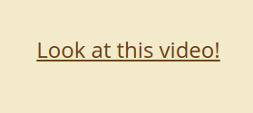
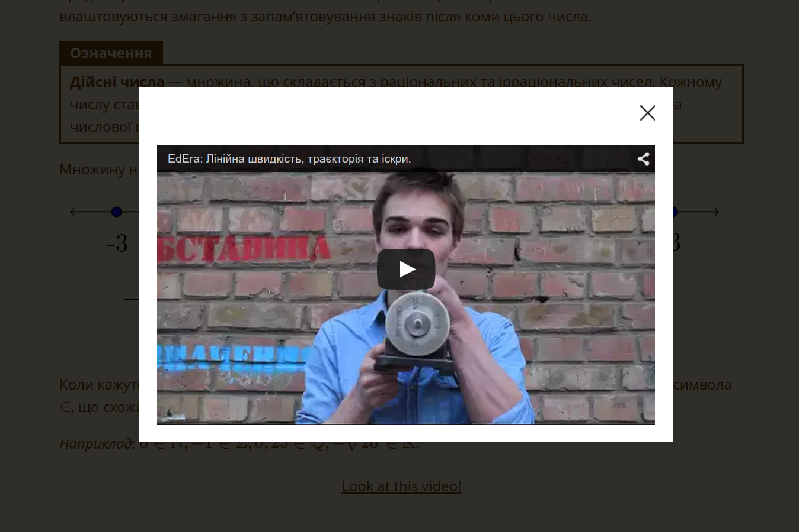
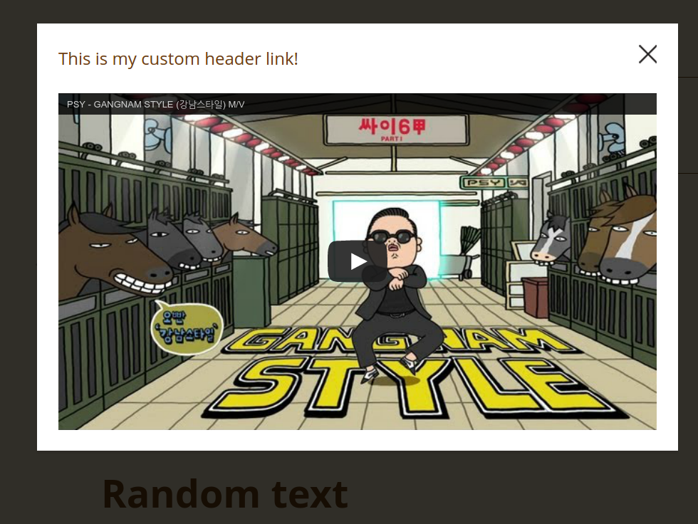

Represent youtube videos inside a modal in your gittbook
==============





This plugins requires gitbook `>=2.0.0`.

### How to use?

Add plugin to your `book.json`, then run `gitbook install`:

```
{
    plugins: ["modal-youtube-video"]
}
```

Add youtube video source and a label for the link after the space

```

https://www.youtube.com/watch?v=uRiLhXiDH18 Look at this video!
```

The video will be replace by the link with given label which opens a modal when clicked.

### Add custom html code to appear in the modal header

It is also possible to add some custom html code which will appear in the modal's header. Imagine, you'd like some link to appear there.
Use pipe to separate youtube link from label and from your custom html header code:

```

http://www.youtube.com/v/9bZkp7q19f0|Look at this video!|<a href="#">This is my custom header link!</a>
```
Your custom header will appear on the left of close button:

